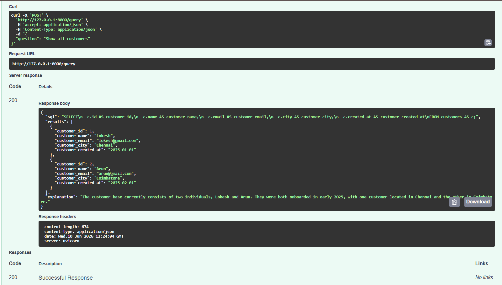
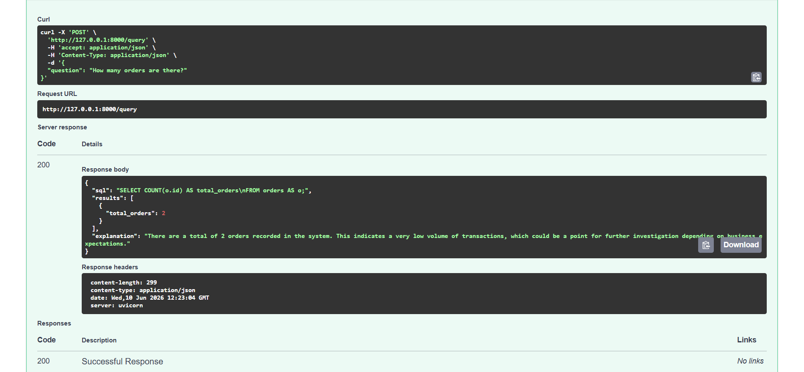
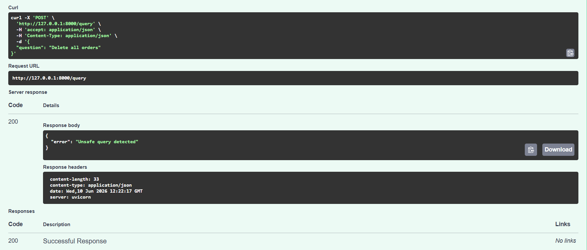

# AI SQL Assistant

## Overview

AI SQL Assistant is a FastAPI-based application that converts natural language questions into SQLite queries using Google's Gemini LLM. The generated SQL is validated for safety, executed against a SQLite database, and the results are returned along with a business-friendly explanation.

This project was developed as part of a technical interview assignment for an AI Engineer / LLM Engineer role.

---

## Features

* Natural Language to SQL conversion using Gemini
* SQLite database integration
* SQL safety validation
* Business-friendly result explanations
* REST API using FastAPI
* Query audit logging
* Swagger API documentation
* Structured JSON responses
* Error handling

---

## Tech Stack

* Python 3.11
* FastAPI
* SQLite
* Google Gemini API
* Pydantic
* python-dotenv

---

## Project Structure

```text
ai-sql-assistant/

├── app.py
├── database.db
├── schema.sql
├── sample_data.py
├── requirements.txt
├── README.md
├── query_logs.json
├── .gitignore

├── models/
│   ├── request.py
│   └── response.py
│
└── services/
    ├── db_service.py
    ├── llm_service.py
    ├── log_service.py
    └── sql_validator.py
```

---

## Architecture

```text
User Question
      |
      v
FastAPI Endpoint
      |
      v
Gemini LLM
(Natural Language → SQL)
      |
      v
SQL Safety Validation
      |
      v
SQLite Database
      |
      v
Results
      |
      v
Business Explanation
      |
      v
JSON Response
```

---

## Database Schema

### customers

| Column     | Type    |
| ---------- | ------- |
| id         | INTEGER |
| name       | TEXT    |
| email      | TEXT    |
| city       | TEXT    |
| created_at | DATE    |

### products

| Column   | Type    |
| -------- | ------- |
| id       | INTEGER |
| name     | TEXT    |
| category | TEXT    |
| price    | REAL    |

### orders

| Column      | Type    |
| ----------- | ------- |
| id          | INTEGER |
| customer_id | INTEGER |
| product_id  | INTEGER |
| quantity    | INTEGER |
| order_date  | DATE    |

---

## Setup Instructions

### Clone Repository

```bash
git clone <repository-url>
cd ai-sql-assistant
```

### Install Dependencies

```bash
pip install -r requirements.txt
```

### Configure Environment Variables

Create a `.env` file in the project root:

```env
GEMINI_API_KEY=your_gemini_api_key
```

### Run Application

```bash
uvicorn app:app --reload
```

Application URL:

```text
http://127.0.0.1:8000
```

Swagger Documentation:

```text
http://127.0.0.1:8000/docs
```

---

## API Endpoint

### POST /query

Request:

```json
{
  "question": "Show all customers"
}
```

Example Response:

```json
{
  "sql": "SELECT * FROM customers",
  "results": [
    {
      "id": 1,
      "name": "Lokesh",
      "email": "lokesh@gmail.com",
      "city": "Chennai"
    }
  ],
  "explanation": "The system currently contains customer information stored in the database."
}
```

---

## SQL Safety Validation

The application only allows read-only SQL queries.

Blocked operations:

* DELETE
* UPDATE
* INSERT
* DROP
* ALTER
* TRUNCATE
* ATTACH
* PRAGMA

Unsafe requests are rejected before execution.

---

## Query Logging

Every request is logged in `query_logs.json` with:

* Timestamp
* User Question
* Generated SQL

This provides basic audit logging and query history.

---

## Screenshots

### Customer Query


### Order Count


### Security Validation


---

## Assumptions

* Gemini generates syntactically valid SQLite queries.
* Users only require read-only access to the database.
* SQLite is sufficient for the assignment scope.

---

## Limitations

* Complex analytical queries may require prompt refinement.
* The application currently supports only SQLite.
* Query accuracy depends on LLM output quality.
* Conversational follow-up questions are not implemented.

---

## Future Improvements

* Multi-turn conversational support
* SQL query explanation endpoint
* Chart recommendations
* Docker deployment
* Authentication and authorization
* Support for PostgreSQL and MySQL

---

## Author

Lokesh U

Technical Interview Assignment Submission
